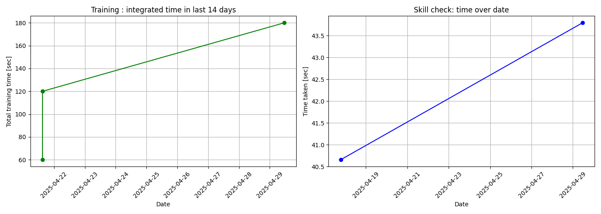

# はじめに(Introduction)
タッチタイプ練習ソフトAoyamaTypeの
履歴機能を使って自分の双曲性について振り返る．

# 方法(Method): .pngの.docx内への取り込み

> aoyamatype -r

で作成される図の下方にあるディスクを模したアイコンをクリックすることで，home directoryにFigure_1.pngという名前のファイルが保存される．

それを，

> mv ~/Figure_1.png .

としてaoyama.mdと同じディレクトリに移す．

以下のようにコマンド入力すると，
``` shell
> pandoc aoyama.md --from=markdown --to=docx --output=aoyama.docx
あるいは
> pandoc aoyama.md --from=markdown --to=docx --standalone --reference-doc=reference.docx --output=aoyama.docx
```
出力された練習の記録とスキルチェックの履歴が.docx内に示される．

# 結果(Results)：練習の成果



ここにグラフの分析を記述する．

# 議論(Discussions): 続ける工夫

では，双曲性の罠を回避するために， みなさんが心がけている，
あるいはAoyamaTypeで実践した， できるだけ沢山のスマート戦略を書き出して
レポートを完成させてください．

