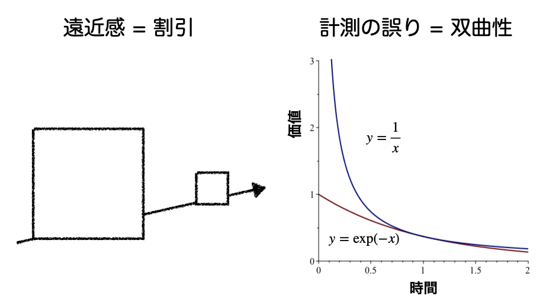

# イントロダクション

[マシュマロテスト](https://qiita.com/daddygongon/items/5d68a28202b43b4dcc04)で試されたように，
人の行動原理の一つに双曲割引と呼ばれるものがあります．
双曲割引の考え方と克服法について報告します．

## 双曲割引

まず双曲割引についてネットで調べると，wikipedia\[1\] では，

> 双曲割引（そうきょくわりびき、英: Hyperbolic
> discounting）は、行動経済学の用語で、遠い将来なら待てるが近い将来ならば待てないという，今までの経済学理論では説明できない非合理的行動を説明する概念として注目されている。時間経過をｘ
> 軸、割引率をy
> 軸とした時のグラフが、時間とともに減少する双曲線（反比例のグラフ）になることから名づけられた。ジョージ・エインズリー・テンプル大学教授（臨床精神医学）が唱えた。
>
> 「今日と明日の違いは明日と明後日の違いより大きい」と説明されている。例えば1年後のダイエットの成果より、目の前のケーキの誘惑に負けたり、1年後のローンの負担より今のキャッシングの買い物が嬉しいということである。これを人間やその人の弱さとしてではなく、動物（人間を含む）の基本的性質として捉える。
>
> 経済学を心理的・精神医学的基盤の上に乗せようとする努力の一環である。今までの経済学は「合理的人間」仮定の上に立っていたが、人間は本来非合理的なものであるということと矛盾するという根本的な問題と、経済理論と現実との不整合が目立ってきたため、それを解決するかも知れない理論と言うことで注目されている。

と記されています．双曲割引は動物の基本的性質であり，経済理論と現実との不整合を解決するかもしれない理論ということが記されています．しかしこの記述だけからでは，割引とか，双曲性などの意味が理解できません．

いまはやりのopen AI(Bing)に

> 双曲割引について詳しく教えてください

とたずねると，

> 双曲割引とは、人が「今」という時間を強く重視する傾向にあることを指します。そのため、同じ金額であっても、「今もらえる報酬」より「将来もらえる報酬の価値」の方が低くなります。その価値の減り方が反比例（双曲）のグラフになるため、双曲割引と呼ばれています
> 。
>
> 例えば、「今すぐもらえる1万円」と「1年後にもらえる1.5万円」の選択肢がある場合、大半は前者を選ぶ傾向にあります。これは行動経済学の考え方で、「双曲割引」という"人のせっかち度"を測る指標で説明できます。
>
> このような心の癖を知ることは、生活を送る上でさまざまな判断をしていく際の大切なヒントになるでしょう
> \[2\]。

と厳密には間違った答えを返してきます．

# 方法

これらのまとめられた検索結果やLLMの回答では，
正しい理解ができるとは限りません． そこでまず，
「お金の受け取り」という具体例で ****割引**** と ****双曲性****
の違いを実感してもらいます． さらに，この双曲割引を提唱した
ジョージ・エインズリーの著作「誘惑される意思」から双曲割引を
わかりやすく説明している箇所を抜粋します \[3\].
また，経済学者の池田の記事\[4\]からスマートな人とナイーブな人の
差を紹介します．

# 結果

## 具体例:お金の受け取り

双曲割引を実感してもらうために，具体的な例としてお金の受け取りを考えてもらいます．

-   今18万円もらうか，1年後に20万円もらうかの選択

-   2年後に18万円もらうか，3年後に20万円もらうかの選択

Table: 表1 お金の受け取りを例にした双曲的選択の例(2024-04-29の授業アンケート).

|    | 18万円 | 20万円 |
| ----- | ----- | ----- |
| 今か1年後か    |        |        |
| 2年後か3年後か |        |        |

いかがでしょう． まず「割引」というのが，
お金の価値が時間が遠くに行くほど小さくなることが理解できるでしょう．
もう一つに，その割引率が金利なんかの指数関数的

$$
y = y_0 \times \exp(-t)
$$

ではないこともわかるでしょうか？
このことから，動物が本性としてもつ割引は，より曲率が大きな双曲的と名付けられています．

これが，

> 遠い将来なら待てるが近い将来ならば待てない

とか

> 今日と明日の違いは明日と明後日の違いより大きい

という言葉の中身です．

## 「誘惑される意思」

### ソクラテスの発言\[3, p.11\]

> 同じ大きさのものでも，近いときには大きく見え，遠いときには小さく見えないだろうか？
>
> （中略）
>
> われわれがあれこれと逡巡し，ある時点で選んだものを，別の時点で後悔するのは「この見かけの力」の持つ欺きの技ではないだろうか？
>
> （中略）
>
> 人々が快楽や苦痛の選択，つまり善と悪の選択においてまちがえるのは，計測と呼ばれる特殊な知識の(中略)欠陥によるのである．

つまり人が視覚的に持っている遠近感が，そのまま時間に対しても成り立ち，さらにその計測に欠陥があると指摘しています．

今まで出てきた謎の文言を視覚的に表すと図1のようになります．
視覚が持っている遠近感が時間の中でのものの価値にも当てはめられていることが
**割引** を， さらにその見え方が理性的とされる指数関数ではなく，
より急な傾きになることが **双曲性**
という用語で示されていることがわかるでしょうか．

* 図1 割引と双曲性の模式図．

### ありがちな例\[3, p.63\]
さらにみぢかな例を見てみましょう．

> ありがちな例をあげよう． あなたは決まった時間に寝るのが嫌いだとする．
> でも，起きたときには寝不足なのはもっといやだ．
> だから，今朝起きたときのあなたは， 昨晩夜更かしした自分を呪い，
> 今晩はちゃんと早めに寝るぞと未来の自分に縛りをかける．
> でもここで双曲割引曲線が効いてくる．
> あなたの心は報酬を求めるプロセスをたくさん抱えており，
> それらはお互いに矛盾していてもそのまま生き残るようになっていて，
> 打ち消しあわずに独立して存在し続ける．
> だから，結局夜になって朝がまだずっと先の時になると，
> やっぱり夜更かししようと思ってしまう．
> 長期的な報酬から言えば早く寝る方がいいのだが，
> それを実現するようなインセンティブを夜の自分に対して提示できない限り，
> この状態は続く．

どうです？よく経験することでしょう？
私も昔はよく，ニコ動の2回目の時報を聞いたものです．
あ，嘘つきました．今は無くなっただけです．
では，どうすれば双曲性の罠にはまらないようにできるのでしょう？

## スマートな人とナイーブな人

経済学者の池田の記事\[4\]によると，

> 双曲的な人は，立派な蓄積や摂生の計画を立てても，
> 実行に移す段階になると，
> それを先延ばしにして現在志向的な行動をとりたくなる．
> それが自滅的な選択につながる．
>
> ただ，先延ばしの誘惑を感じても負けずに前に立てた計画を実行する人もいる．
> 面倒な仕事を持ち越しても，いずれはまた同じ窮状に陥ることを知っているからだ．
> 経済学では，将来の衝動的な自分を正確に自覚している主体を
> 「賢明（ソフィスティケイテッド，スマート）」な意志決定者，
> 自覚しない人を「単純（ナイーブ）」な選択者という．

としています．

「先送り戦略」の罠にはまらないようにするには，自分の中の「双曲性」を自覚した上で，
将来の自分を信頼せずに縛りをうまくかける方法を考えればいいわけです．

# 議論：自分の工夫

出かけるときに思い出した用事を先送りしてしまうのは双曲性の罠にハマっている典型です．
今の5分間より将来の5分間のほうがちっちゃく見えるから．
「なんですぐに先送りしちゃうんやろう」というのが長いこと嫌やったんですが，
それが動物の本性に由来するというのがわかって，それから気が楽になりました．
「俺のせいやない，双曲性のせいなんや」って．
私は，「いつやるか？今でしょ！」 \[5\] と叫んだ東進の先生にならって，
すぐやるというデフォルトを意識しています．
一度デフォルト変えると，それを「継続しがち」という自分の中の双曲性を利用しています．

では，双曲性の罠を回避するために， みなさんが心がけている，
あるいはAoyamaTypeで実践した， できるだけ沢山のスマート戦略を書き出して
レポートを完成させてください．

# 引用文献

1.  「双曲割引」，https://ja.wikipedia.org/wiki/双曲割引, 2024-04-22
    accessed.
2.  Bing on Edge on Win11, 2023-04-20
    accessed，同じ質問を2023-05-01にしたところ，上記のWikipediaの記述がそのまま出てきました．さらに，同じ質問を2024-04-22にしたところ，より詳細な回答が返ってくるようになってました．
3.  「誘惑される意思」，ジョージ・エインズリー, 山形 浩生訳,(NTT出版
    2006).
4.  「『自滅選択』回避する政策余地」,
    池田新介，日本経済新聞「経済教室」,2012-3-26朝刊.
5.  「いつやるか? 今でしょ! 」，林 修，(宝島社 2012).
